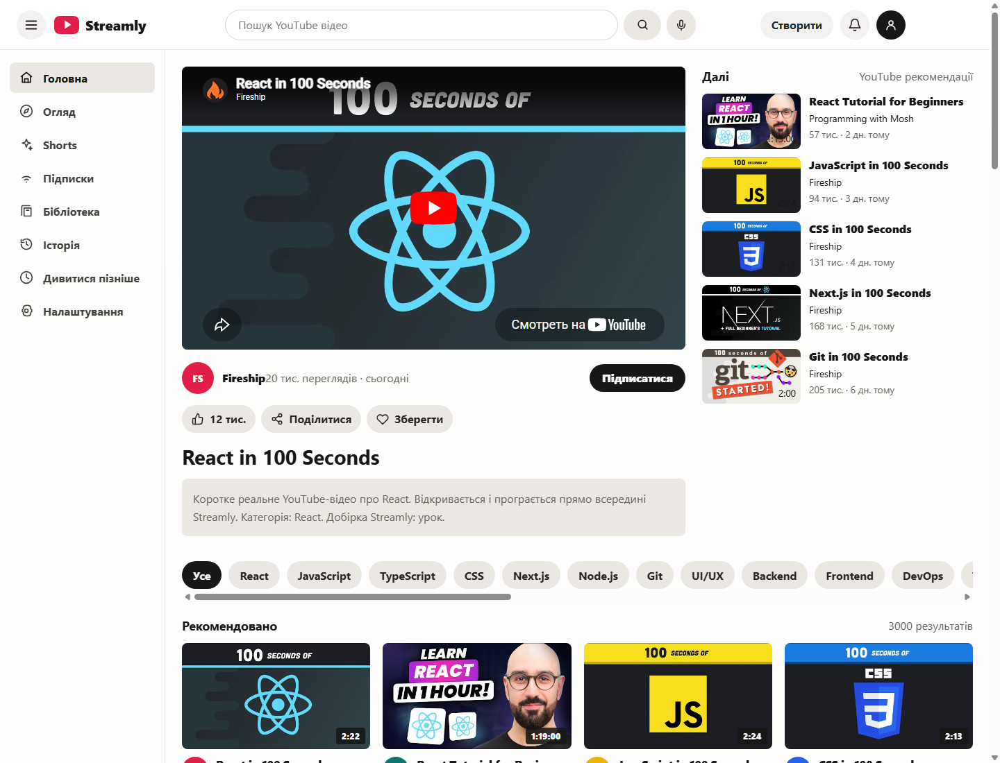

# Streamlya



Streamlya це веб застосунок для перегляду відео у форматі сучасного відеосервісу. У ньому є головна сторінка з великим плеєром, стрічка рекомендацій, пошук, категорії, бокове меню, сторінка Shorts, підписки, бібліотека, історія переглядів і список для перегляду пізніше.

Онлайн версія після деплою буде доступна тут:

```text
https://mishadoloh.github.io/Streamlya/
```

Проект написаний на React. Інтерфейс розбитий на окремі частини, щоб код було легко читати, підтримувати і розширювати. Структура знаходиться у папці `src` і поділена на `app`, `pages`, `features`, `components`, `shared`, `hooks`, `services`, `store`, `types` і `utils`.

Відео відкриваються через вбудований YouTube плеєр. У каталозі є різні напрямки: ігри, хорори, летсплеї, трейлери, інді, музика, live, розробка та навчальні відео. Пошук працює за назвою, каналом і категорією.

Стан перегляду зберігається під час поточної сесії. Можна ставити лайк, зберігати відео, підписуватися на канал, відкривати історію та переходити між розділами через меню.

## Запуск

Встановлювати залежності не потрібно.

```bash
npm run dev
```

Після запуску сайт буде доступний за адресою:

```text
http://127.0.0.1:4174/
```

## Структура

```text
src/
  app/
  pages/
  features/
  components/
  shared/
  hooks/
  services/
  store/
  types/
  utils/
```
